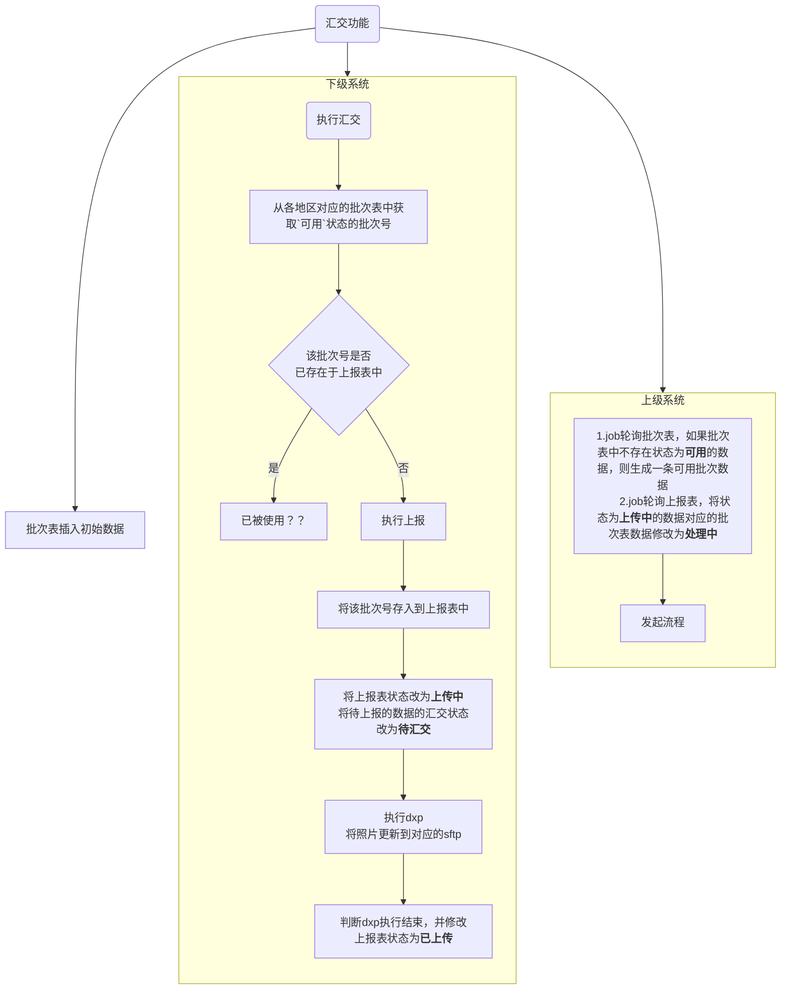
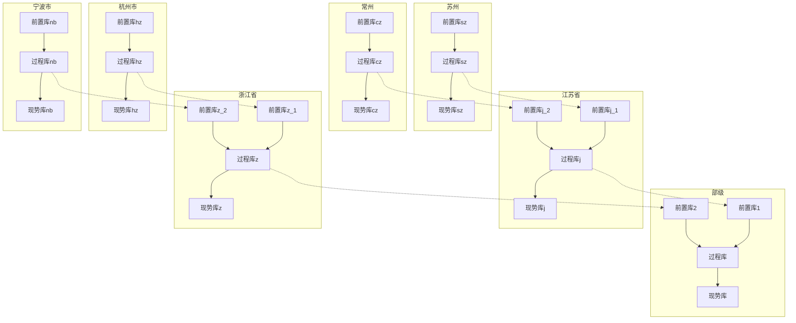

```mermaid
	graph TB
	id0(汇交功能) --> id1[批次表插入初始数据]
	id0 --> 下级系统
	id0 --> 上级系统
	
	subgraph 下级系统
	direction TB
	id2(执行汇交) --> id3[从各地区对应的批次表中获取`可用`状态的批次号] 
	--> id4{该批次号是否</br>已存在于上报表中}
	id4 --是--> id5[已被使用？？]
	id4 --否-->执行上报
	--> id6[将该批次号存入到上报表中]
    --> id7["`
    将上报表状态改为**上传中**
    将待上报的数据的汇交状态改为**待汇交**
    `"]
	--> id8[执行dxp</br>将照片更新到对应的sftp]
	--> id9["`判断dxp执行结束，并修改上报表状态为**已上传**`"]
	end
	
	subgraph 上级系统
	direction TB
	a1["`
	1.job轮询批次表，如果批次表中不存在状态为**可用**的数据，则生成一条可用批次数据
	2.job轮询上报表，将状态为**上传中**的数据对应的批次表数据修改为**处理中**
	`"]
	--> a2[发起流程]
	end

	
	
```

```mermaid
	graph TB
	
	subgraph 部级
    前置库1 --> 过程库 --> 现势库
    前置库2 --> 过程库
    end
	
    subgraph 江苏省
    前置库j_1 --> 过程库j --> 现势库j
    前置库j_2 --> 过程库j
    end
    
	subgraph 苏州
	前置库sz --> 过程库sz --> 现势库sz
	end
	
	subgraph 常州
	前置库cz --> 过程库cz --> 现势库cz
	end
	
	subgraph 浙江省
    前置库z_1 --> 过程库z --> 现势库z
    前置库z_2 --> 过程库z
    end
    
   	subgraph 杭州市
	前置库hz --> 过程库hz --> 现势库hz
	end
	
	subgraph 宁波市
	前置库nb --> 过程库nb --> 现势库nb
	end
	
	
	过程库j -.->前置库1
	过程库z -.->前置库2
	
	过程库hz -.-> 前置库z_1
	过程库nb -.-> 前置库z_2
	
	过程库sz -.-> 前置库j_1
	过程库cz -.-> 前置库j_2
	
	
```

