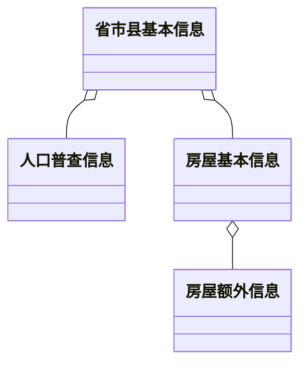
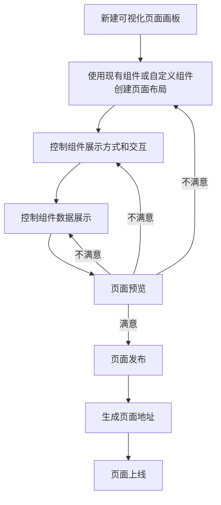

```mermaid
classDiagram
	  省市县基本信息 o-- 人口普查信息
      省市县基本信息 o-- 房屋基本信息
      房屋基本信息 o-- 房屋额外信息
      
```

1. 协助山东处理dxp和业务系统的问题
2. dxp上数据处理流程支持多个dxp系统对应一个业务系统
3. 全文检索深度查询功能支持

1. 房普房屋建筑页面和项目组上功能同步
2. 全文检索指标元件配置功能开发

```mermaid
graph TD
    新建可视化页面画板 --> 使用现有组件或自定义组件创建页面布局 --> 控制组件展示方式和交互 --> 控制组件数据展示 --> 页面预览 --满意--> 页面发布 --> 生成页面地址 --> 页面上线
   
    页面预览 --不满意--> 使用现有组件或自定义组件创建页面布局
    
    页面预览 --不满意--> 控制组件展示方式和交互
    
    页面预览 --不满意--> 控制组件数据展示

```

