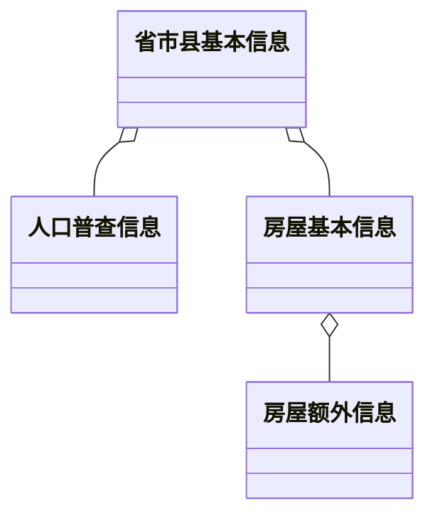
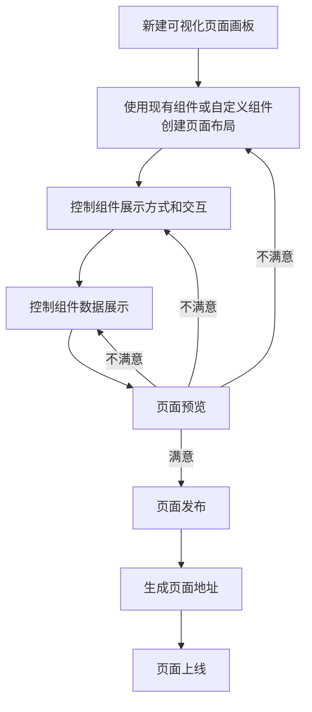
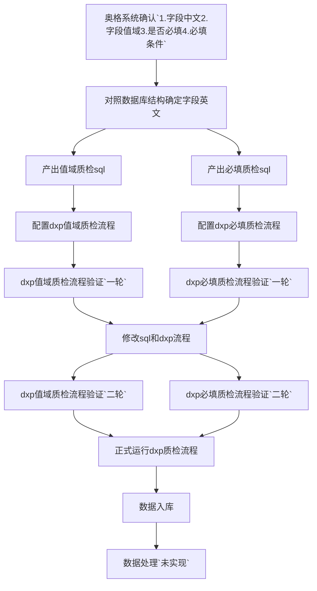
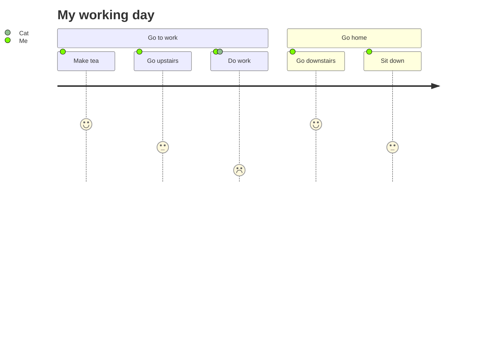

1. 协助山东处理dxp和业务系统的问题
2. dxp上数据处理流程支持多个dxp系统对应一个业务系统
3. 全文检索深度查询功能支持


1. 房普房屋建筑页面和项目组上功能同步
2. 全文检索指标元件配置功能开发







> 【腾讯文档】代码项质检规则
> https://docs.qq.com/sheet/DR2FWdFhWdE9ZUXFx?tab=lqjjml
>
> 【腾讯文档】房屋市政必填字段
> https://docs.qq.com/sheet/DR1Z5R0xPUmxoU09N?tab=f2eajn


```
'../../../datapush/css/images/checked.svg'
"../../../datapush/css/images/check.svg"
```


```
docker run -d --name kingbasev8r6 -p 54321:54321 \
-e SYSTEM_USER=kingbasees \
-e SYSTEM_PWD=kingbasees \
-e ENCODING=UTF8 \
-e DATABASE_MODE=pg  \
-e BLOCK_SIZE=8  \
-v /opt/kingbase/license.dat:/opt/kingbase/Server/bin/license.dat \
chyiyaqing/kingbase:v8r6


cp -r bin/* /opt/kingbase/Server/bin/
cp -r lib/* /opt/kingbase/Server/lib/
cp -r share/extension/* /opt/kingbase/Server/share/extension/
```




