[关于 Mermaid | Mermaid 中文网 (nodejs.cn)](https://mermaid.nodejs.cn/intro/)

## 1. 基础类

### 1.1 流程图

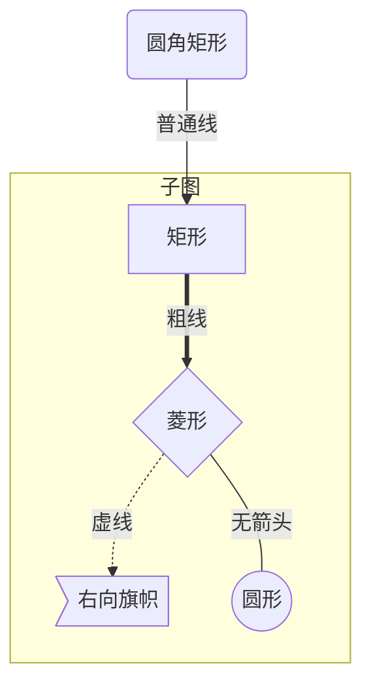

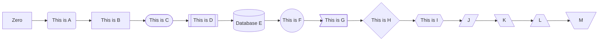

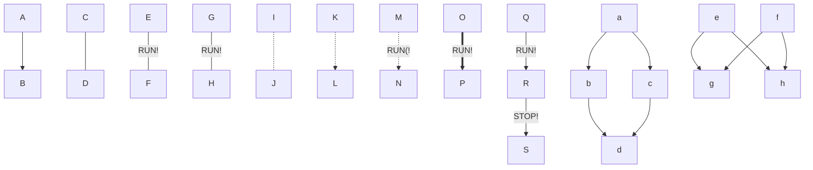

#### - 方向

| 用词 | 含义     |
| ---- | -------- |
| TB   | 从上到下 |
| BT   | 从下到上 |
| RL   | 从右到左 |
| LR   | 从左到右 |

#### - 节点

| 表述       | 说明           |
| ---------- | -------------- |
| id[文字]   | 矩形节点       |
| id(文字)   | 圆角矩形节点   |
| id((文字)) | 圆形节点       |
| id>文字]   | 右向旗帜状节点 |
| id{文字}   | 菱形节点       |

#### - 连线

| 表述       | 说明           |
| ---------- | -------------- |
| >          | 添加尾部箭头   |
| -          | 不添加尾部箭头 |
| --         | 单线           |
| --text--   | 单线上加文字   |
| `==`       | 粗线           |
| `==text==` | 粗线加文字     |
| -.-        | 虚线           |
| -.text.-   | 虚线加文字     |

### 1.2 时序图

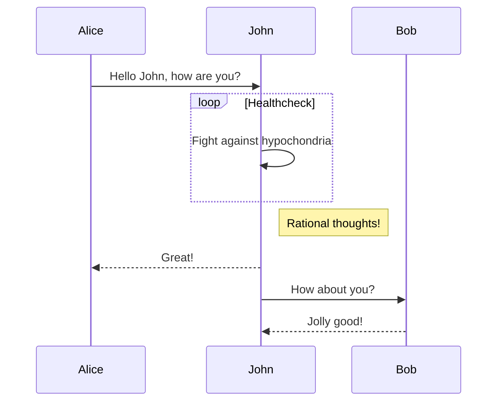

### 1.3 Gantt 图

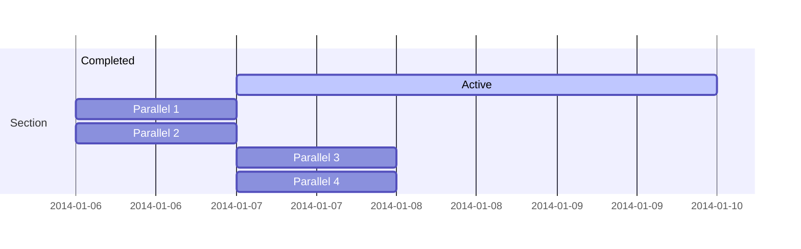

## 2. 工程类

### 2.1 类图

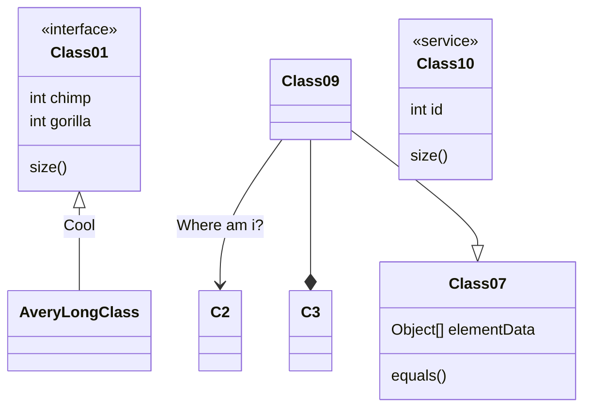

### 2.2 状态图

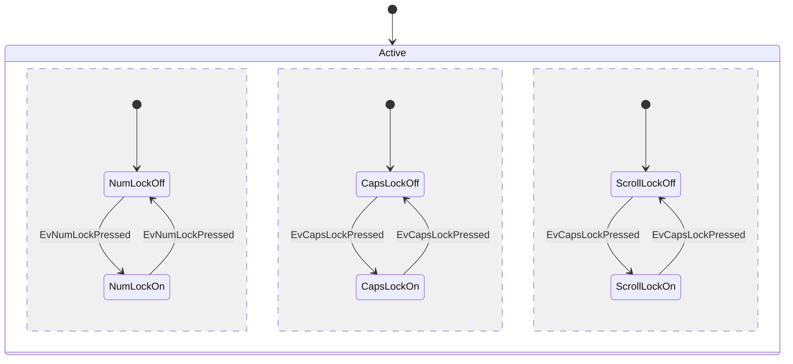

### 2.3 实体关系图

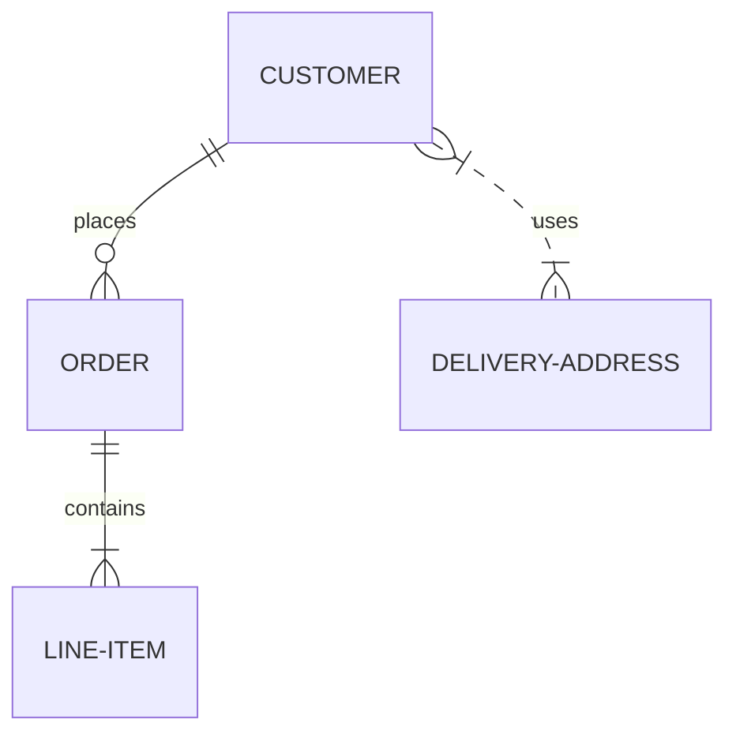

### 2.4 Git 图

## 3. 统计类

### 3.1 饼图

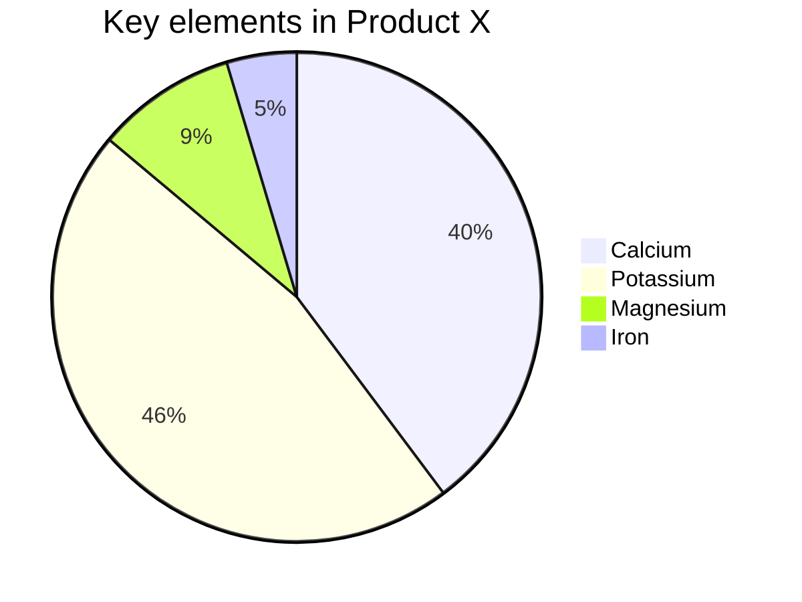

## 4. 其他类

### 4.1 旅程图

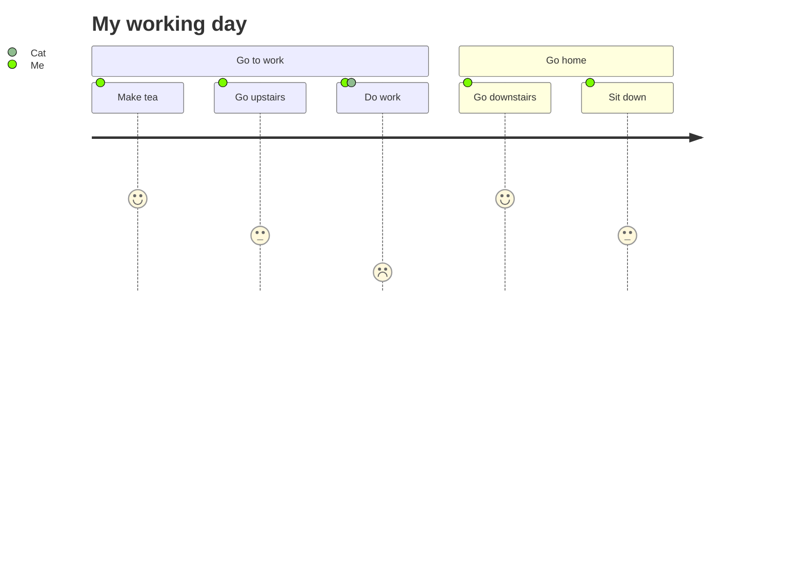

### 4.2 时间线

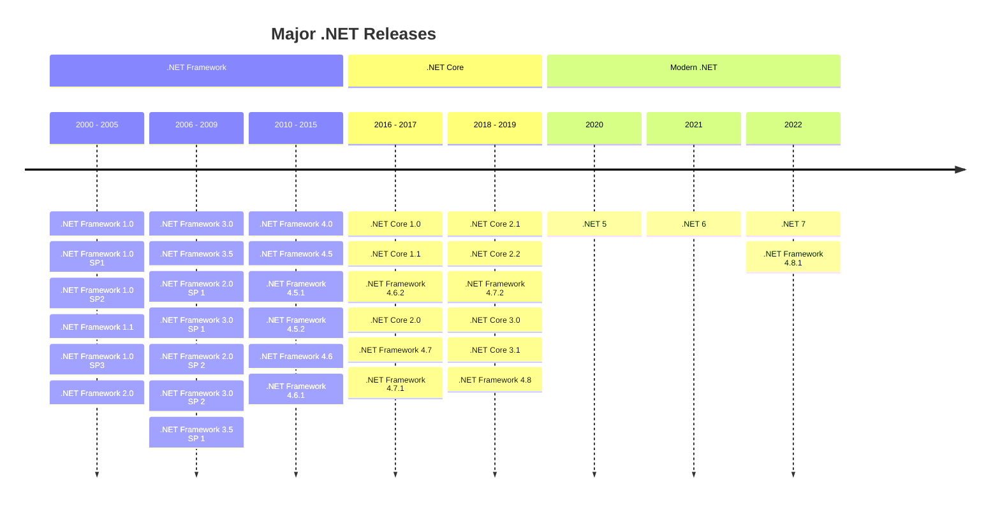

