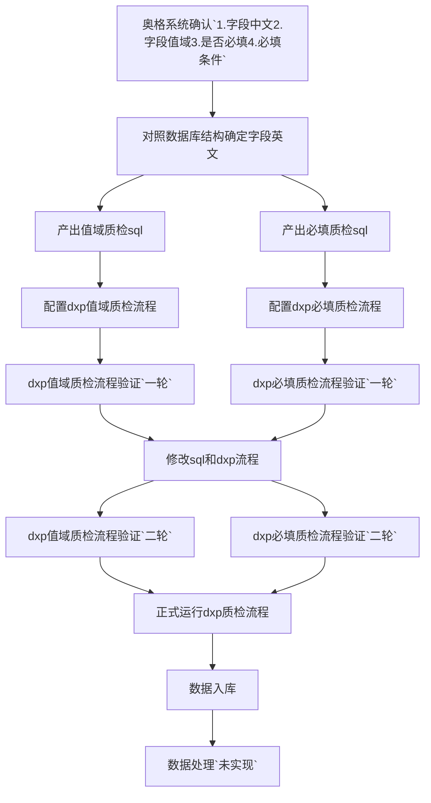

### 1.工作流程

### 2.质检统计

| 表名     | 规则数（个） | 问题数据（条） |
| -------- | :-----: | :-----: |
| 城镇住宅 | 9 | 295 |
| 城镇非住宅 | 15 | 16951 |
| 农村独立住宅 | 7 | 367 |
| 农村集合住宅 | 4 | 776 |
| 农村非住宅 | 5 | 1219 |
| 市政道路 | 3 | 1120 |
| 道路分段 | 11 | 16388 |
| 道路设施 | 11 | 959 |
| 市政桥梁 | 29 | 116839 |
| 供水厂站 | 17 | 3727 |
| 厂站单体 | 11 | 27894 |
| 供水管线 | 13 | 21 |

> 详细问题见：
>
> 【腾讯文档】count
> https://docs.qq.com/sheet/DR0RTd3poVE9FUkth?tab=BB08J2
>
> ---
>
> 详细规则见：
>
> 【腾讯文档】代码项质检规则
> https://docs.qq.com/sheet/DR2FWdFhWdE9ZUXFx?tab=lqjjml
>
> 【腾讯文档】房屋市政必填字段
> https://docs.qq.com/sheet/DR1Z5R0xPUmxoU09N?tab=f2eajn

