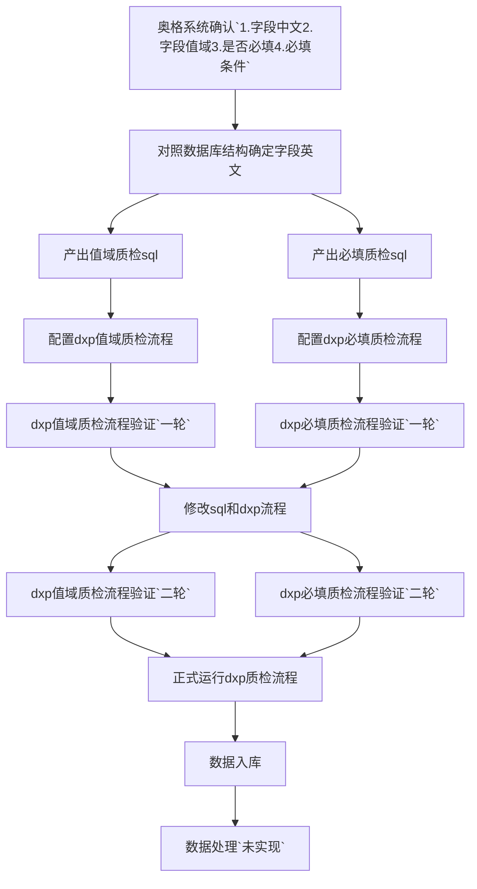

```mermaid
graph TD
    奥格系统确认`1.字段中文2.字段值域3.是否必填4.必填条件` --> 对照数据库结构确定字段英文 --> 产出值域质检sql --> 配置dxp值域质检流程 --> dxp值域质检流程验证`一轮`--> 修改sql和dxp流程 --> dxp值域质检流程验证`二轮` --> 正式运行dxp质检流程 --> 数据入库 --> 数据处理`未实现`
    
    
     对照数据库结构确定字段英文 --> 产出必填质检sql --> 配置dxp必填质检流程 --> dxp必填质检流程验证`一轮` --> 修改sql和dxp流程 --> dxp必填质检流程验证`二轮` --> 正式运行dxp质检流程
```

【腾讯文档】代码项质检规则
https://docs.qq.com/sheet/DR2FWdFhWdE9ZUXFx?tab=lqjjml

【腾讯文档】房屋市政必填字段
https://docs.qq.com/sheet/DR1Z5R0xPUmxoU09N?tab=f2eajn
