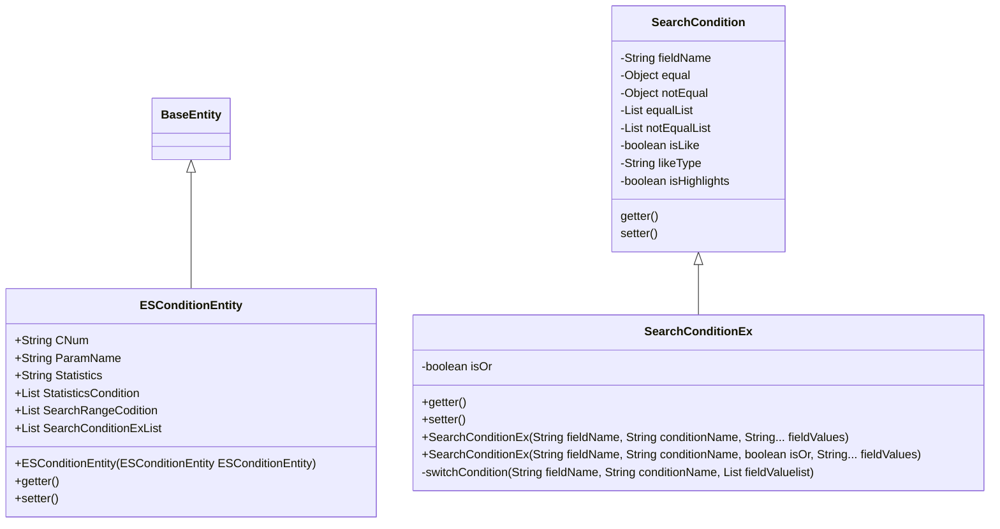

```mermaid
classDiagram
	  BaseEntity <|-- ESConditionEntity

      class ESConditionEntity{
          +String CNum
          +String ParamName
          +String Statistics
          +List<StatisticsCondition> StatisticsCondition
          +List<searchRangeCodition> SearchRangeCodition
          +List<SearchConditionEx> SearchConditionExList
          +ESConditionEntity(ESConditionEntity ESConditionEntity)
          +getter()
          +setter()
      }
      SearchCondition <|-- SearchConditionEx
      class SearchCondition{
          -String fieldName
          -Object equal
          -Object notEqual
          -List<Object> equalList
          -List<Object> notEqualList
          -boolean isLike
          -String likeType
          -boolean isHighlights
          getter()
          setter()
      }
      
      class SearchConditionEx{
          -boolean isOr
          +getter()
          +setter()
          +SearchConditionEx(String fieldName, String conditionName, String... fieldValues)
          +SearchConditionEx(String fieldName, String conditionName, boolean isOr, String... fieldValues) 
          -switchCondition(String fieldName, String conditionName, List<Object> fieldValuelist)
      }
      
      

```

