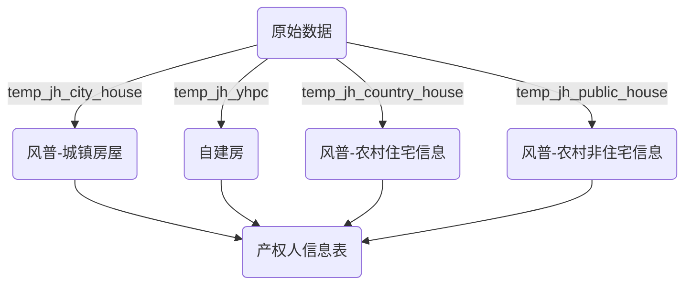
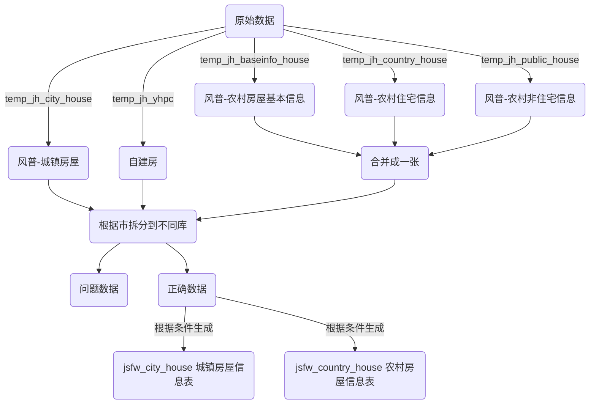

```mermaid
graph TD
A(原始数据)--temp_jh_city_house-->A1(风普-城镇房屋)
A(原始数据)--temp_jh_yhpc-->A2(自建房)
A(原始数据)--temp_jh_country_house-->A4(风普-农村住宅信息)
A(原始数据)--temp_jh_public_house-->A5(风普-农村非住宅信息)


A1 --> D(产权人信息表)
A2 --> D(产权人信息表)
A4 --> D(产权人信息表)
A5 --> D(产权人信息表)
```

```mermaid
graph TD

A(原始数据)--temp_jh_city_house-->A1(风普-城镇房屋)
A(原始数据)--temp_jh_yhpc-->A2(自建房)
A(原始数据)--temp_jh_baseinfo_house-->A3(风普-农村房屋基本信息)
A(原始数据)--temp_jh_country_house-->A4(风普-农村住宅信息)
A(原始数据)--temp_jh_public_house-->A5(风普-农村非住宅信息)


A3 --> AA(合并成一张)
A4 --> AA
A5 --> AA

A1 --> B1(根据市拆分到不同库)
A2 --> B1
AA --> B1

B1 --> problems(问题数据)
B1 --> noproblems(正确数据)

noproblems --根据条件生成--> C(jsfw_city_house 城镇房屋信息表)
noproblems --根据条件生成--> D(jsfw_country_house 农村房屋信息表)
```

