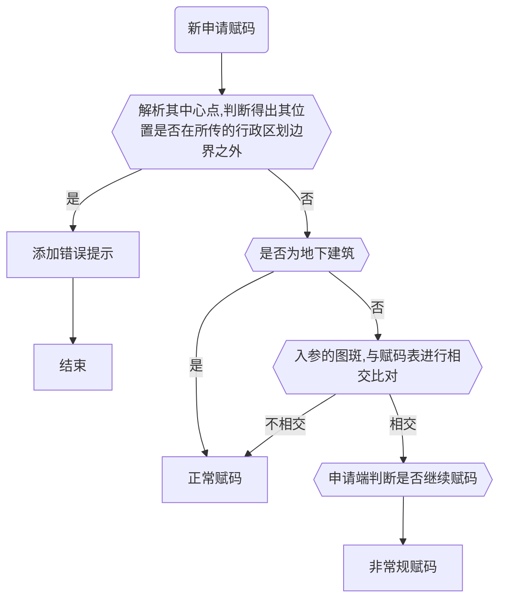
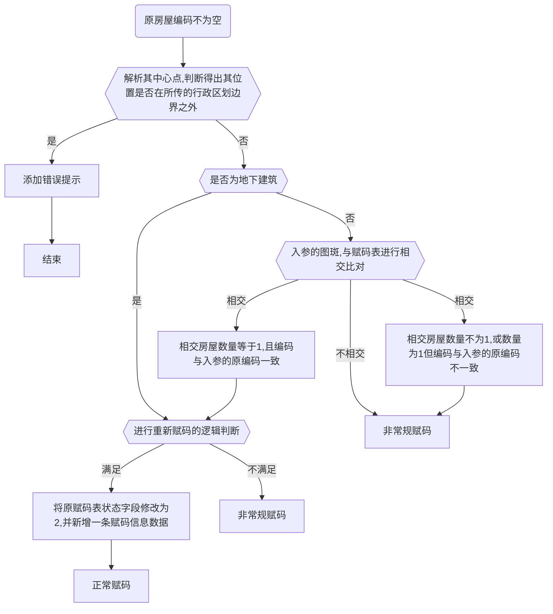

```mermaid
graph TB

id1(新申请赋码)-->id2{{解析其中心点,判断得出其位置是否在所传的行政区划边界之外}}
id2--是-->id3[添加错误提示]-->id10[结束]
id2--否-->id7{{是否为地下建筑}}
id7--是-->id6
id7--否-->id4{{入参的图斑,与赋码表进行相交比对}}
id4--相交-->id5{{申请端判断是否继续赋码}}-->id9[非常规赋码]
id4--不相交-->id6[正常赋码]

```

```mermaid
graph TB

id1(原房屋编码不为空)-->id2{{解析其中心点,判断得出其位置是否在所传的行政区划边界之外}}
id2--是-->id3[添加错误提示]
id3-->id7[结束]
id2--否-->id20{{是否为地下建筑}}
id20--是-->id8
id20--否-->id4{{入参的图斑,与赋码表进行相交比对}}
id4--不相交-->id12
id4--相交-->id5[相交房屋数量等于1,且编码与入参的原编码一致]
id5-->id8{{进行重新赋码的逻辑判断}}

id8--满足-->id15[将原赋码表状态字段修改为2,并新增一条赋码信息数据]-->id9[正常赋码]
id8--不满足-->id22[非常规赋码]
id4--相交-->id16[相交房屋数量不为1,或数量为1但编码与入参的原编码不一致]
id16-->id12[非常规赋码]
```

