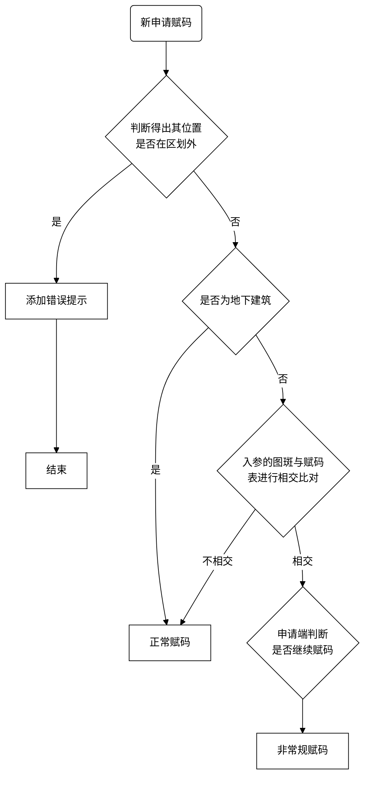
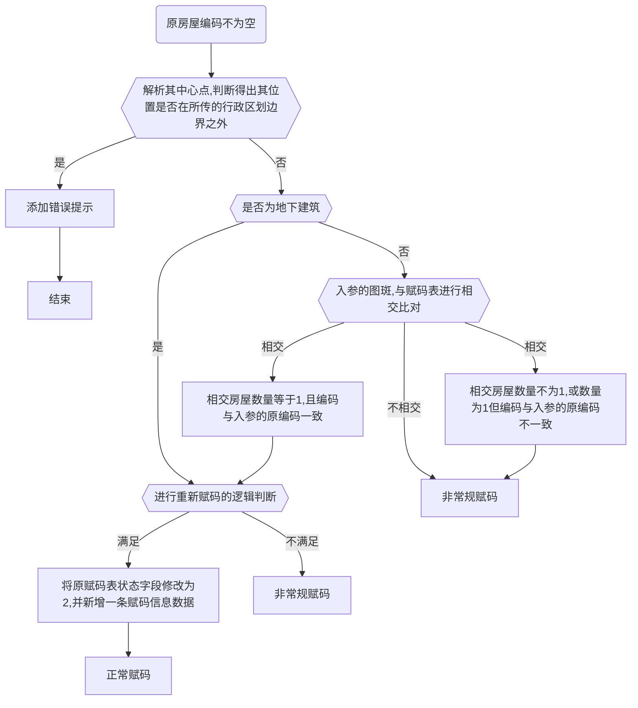
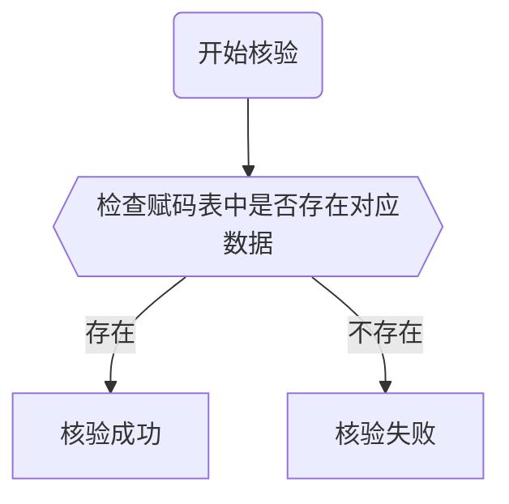
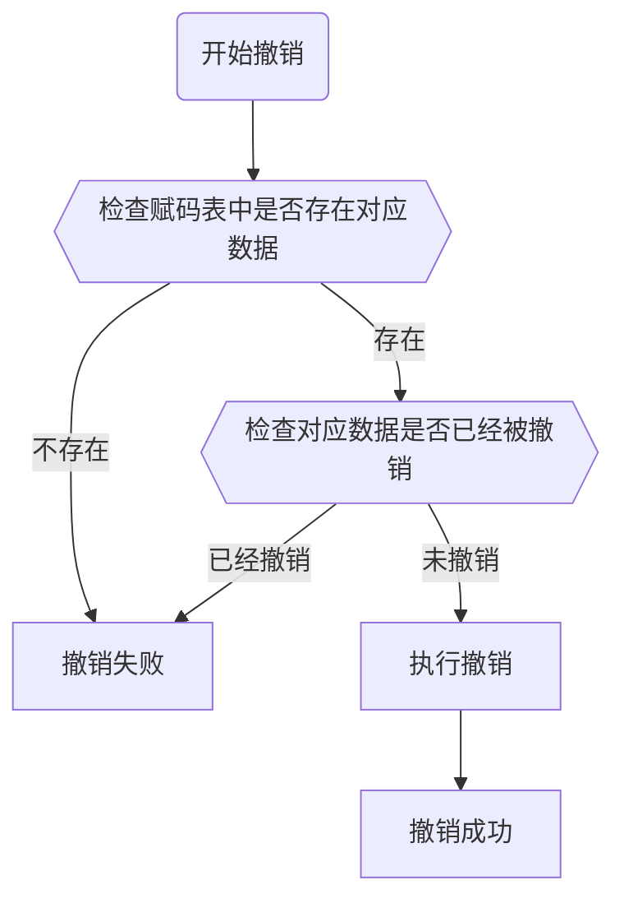

```mermaid
%%{
  init: {
    'theme': 'base',
    'themeVariables': {
      'primaryColor': '#fff',
      'primaryTextColor': '#000',
      'primaryBorderColor': '#000',
      'lineColor': '#000',
      'fontSize':'15px'
    }
  }
}%%
graph TB

id1(新申请赋码)-->id2{判断得出其位置</br>是否在区划外}
id2--是-->id3[添加错误提示]-->id10[结束]
id2--否-->id7{是否为地下建筑}
id7--是-->id6
id7--否-->id4{入参的图斑与赋码</br>表进行相交比对}
id4--相交-->id5{申请端判断</br>是否继续赋码}-->id9[非常规赋码]
id4--不相交-->id6[正常赋码]

```

```mermaid
graph TB

id1(原房屋编码不为空)-->id2{{解析其中心点,判断得出其位置是否在所传的行政区划边界之外}}
id2--是-->id3[添加错误提示]
id3-->id7[结束]
id2--否-->id20{{是否为地下建筑}}
id20--是-->id8
id20--否-->id4{{入参的图斑,与赋码表进行相交比对}}
id4--不相交-->id12
id4--相交-->id5[相交房屋数量等于1,且编码与入参的原编码一致]
id5-->id8{{进行重新赋码的逻辑判断}}

id8--满足-->id15[将原赋码表状态字段修改为2,并新增一条赋码信息数据]-->id9[正常赋码]
id8--不满足-->id22[非常规赋码]
id4--相交-->id16[相交房屋数量不为1,或数量为1但编码与入参的原编码不一致]
id16-->id12[非常规赋码]
```

```mermaid
graph TB

id1(开始核验)-->id2{{检查赋码表中是否存在对应数据}}
id2--存在-->id3[核验成功]
id2--不存在-->id4[核验失败]
```

```mermaid
graph TB

id1(开始撤销)-->id2{{检查赋码表中是否存在对应数据}}
id2--不存在-->id4[撤销失败]
id2--存在-->id3{{检查对应数据是否已经被撤销}}
id3--已经撤销-->id4
id3--未撤销-->id5[执行撤销]-->id6[撤销成功]
```

